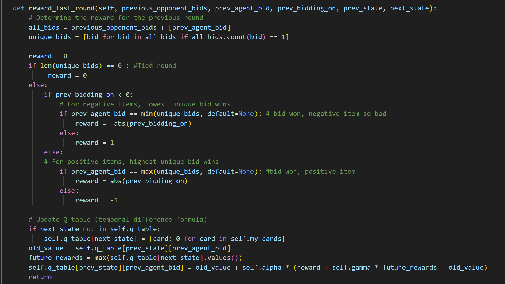
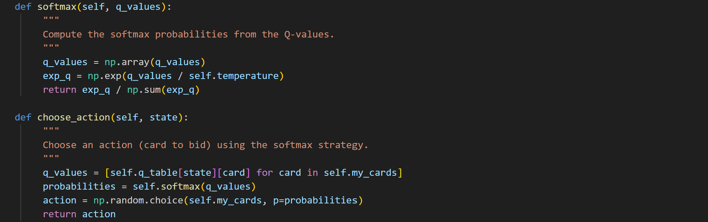
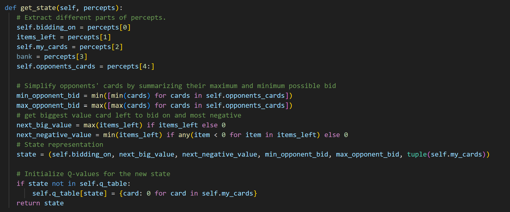

# Reinforcement Learning Agent for the Card Game Raj

## Overview:
This project involved designing and implementing a Reinforcement Learning (RL) agent capable of playing the strategic bidding card game Raj. The objective was to develop an intelligent agent that learns to maximize its score by making optimal bidding decisions through experience.

## Approach:
The agent was built using the Q-learning algorithm with a softmax action selection strategy to balance exploration and exploitation. A simplified state representation was designed to capture key elements of the game, including:

* The current item’s value (positive or negative)
* Cards remaining in the agent’s hand
* Opponents’ potential card ranges
* Upcoming item values

The agent maintained a Q-table to estimate expected rewards for each state-action pair. Rewards were given after each round and at the end of each game, allowing the agent to refine both short-term and long-term strategies. Opponent behavior was also tracked to improve decision-making over time.

## Training:
The RL agent was trained over 15,000 games against opponents with varying strategies — including random and value-based agents — to improve generalization. Hyperparameters (learning rate, discount factor, and temperature) were tuned for optimal performance.

## Code Snippets

## Results:
After training, the agent achieved a 64% win rate against mixed-strategy opponents and demonstrated strong adaptability to different play styles. Its learning curve showed rapid improvement in the early stages before stabilizing, indicating successful convergence of the Q-learning process. 

## Reflection:
### Key Learnings
Building this agent strengthened my understanding of reinforcement learning, particularly:
* Designing effective state representations for large or complex environments
* Balancing exploration and exploitation through probabilistic policies
* Structuring reward signals to balance short-term and long-term goals
* Managing persistent learning and training session workflows

This project deepened my understanding of reinforcement learning fundamentals, including state representation, reward design, and exploration-exploitation balance. Implementing the Q-learning algorithm in a multi-agent environment like Raj was challenging but provided valuable hands-on experience in applying RL concepts to real-world decision-making problems.

## Technologies Used:
Python · NumPy · Pickle · Reinforcement Learning · Q-learning · Game AI
